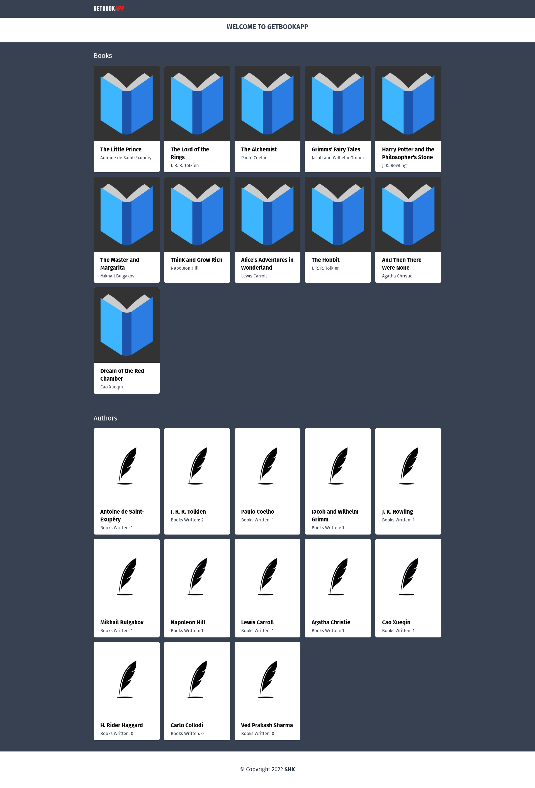

# Get Book App
Whole project uses Node 16

## Backend
Uses:
* Nest js
* Postgresql
  
### Backend Project configuration

Start by cloning this project on your workstation.
The next thing will be to install all the dependencies of the project.

```sh
cd backend
npm install
```

Once the dependencies are installed, you can now configure your project by creating a new `.env` file containing your environment variables used for development.

```
cp .env.example .env
vi .env
```

Now create the database, for your convinience, there is a script that create a postgres database using docker

```
npm run start:dev:db
```

**Note: If you get an error about Port 5432 in used. Make sure to stop any instance of postgresql running locally and try it again.**

Once you have created the database, its time to run the migrations and seed data

```
npm run migration:run
```

Now start the backend app 
```
npm run dev
```

The api base URL is `localhost:4000/api/v1`
Also you can see the whole api documentation at http://localhost:4000/docs/

#### Structure

```
migrations/  # TypeORM migrations created using
├── modules
│   ├── app.module.ts
│   ├── common/  # The common module contains pipes, guards, service and provider used in the whole application
│   ├── author/  # A module that manages "author" resources
│   │   ├── controller/
│   │   │   └── author.controller.ts
│   │   ├── flow/  # The "flow" directory contains the pipes, interceptors and everything that may change the request or response flow
│   │   │   └── author.pipe.ts
│   │   ├── model/
│   │   │   ├── author.data.ts  # The model that will be returned in the response
│   │   │   ├── author.entity.ts  # The actual TypeORM entity
│   │   │   └── author.input.ts  # The model that is used in the request
│   │   ├── author.module.ts
```


## Frontend

This is an app with a backend using:
* Next.js
* Tailwinds

With the backend up and runnning you can start the Frontend App

```
cd frontend
npm install
npm run dev
```

#### Structure

```
components/  # A folder containing all components used in the app
config/ 
│   ├── index.js # Stores the config values for the app (API BASE URL)
pages/ # All the pages for the app (index.js)
public/ # Public resources for the app (images, svgs etc)
styles/ # STyles for the app
```


